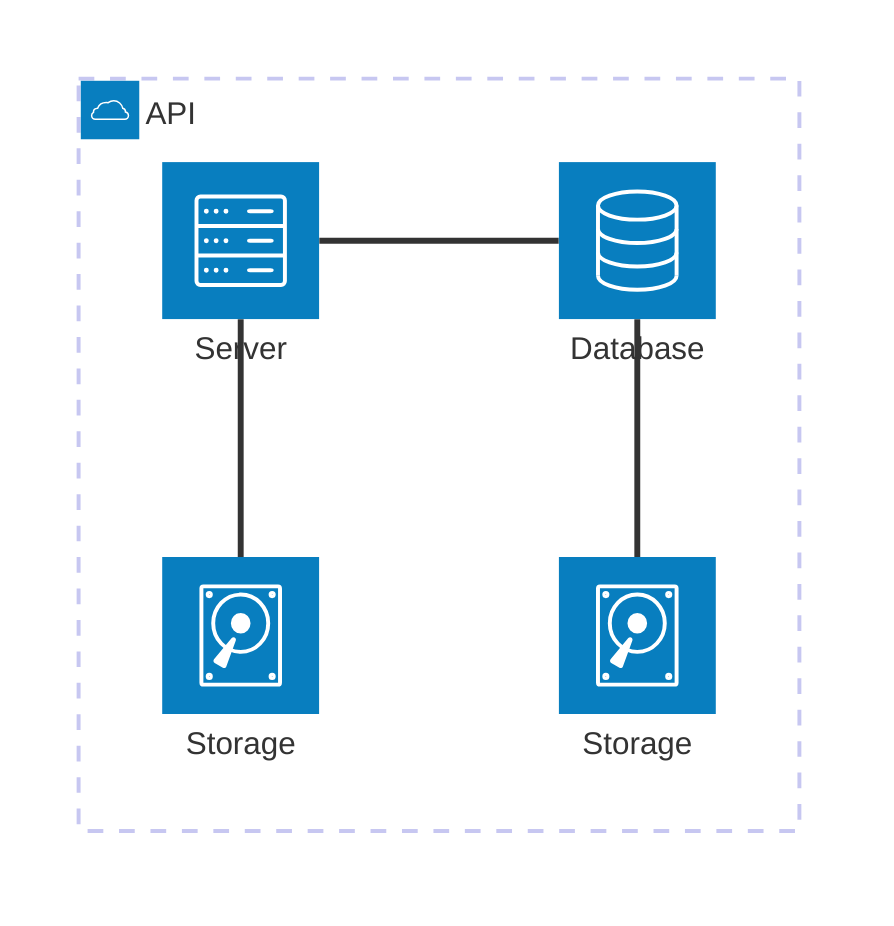

<!-- # Hardware in Context -->
## What is the Whistler Catcher VLF Reception System?
The Whistler Catcher VLF Reception System is a very low frequency software defined radio (VLF SDR) system. It utilizes an open hardware, open software, and open data design and philosophy to facilitate and promote citizen science in the study of VLF phenomena; including the Earth's natural radio emissions, VLF amateur radio transmissions in the 8270 Hz and 5710 Hz bands, and lightning stroke location. 

<!-- # Hardware Description -->
The system consists of both hardware and software. The hardware consists of VLF Active Antenna along with a VLF interface box to supply power and interface the signal; a GNSS interface box to provide a pulse per second (PPS) signal for the purposes of frequency calibration and timestamping; a Behringer UMC202HD USB audio interface for data acquisition, and a thin client PC with serial port. The designs of the VLF Active Antenna, VLF Interface Box, and GNSS Interface Box are all open hardware. The software includes vlfrx-tools, an open source software toolkit primarily for the application of VLF signal capturing, calibration, timestamping, filtering, storage, live listening, retrieval, visualization, EbNaut amateur mode decoding, and other signal processing functions in over 30 individual program utilities. It was written by Paul Nicholson G8LMD [SK], a passionate VLF enthusiast to which the Whistler Catcher VLF Reception System is dedicated to. 

<!-- # Hardware Description -->
<!-- ##  Design Files, summary -->

# HamSCI DASI2 Kit Installation

<!-- Two subsections: kit manufacture and kit assembly -->
<!-- ## Kit Assembly -->
### Install active antenna outside
### Run feedline inside
### Connect System Components
(TODO: Mermaid diagram)

### Power On 

## Software Setup
(Zenodo link for SD card image)

## Calibration Procedure
